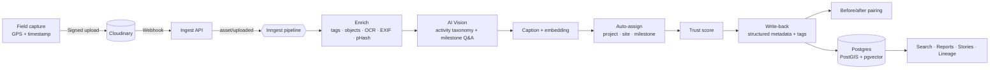
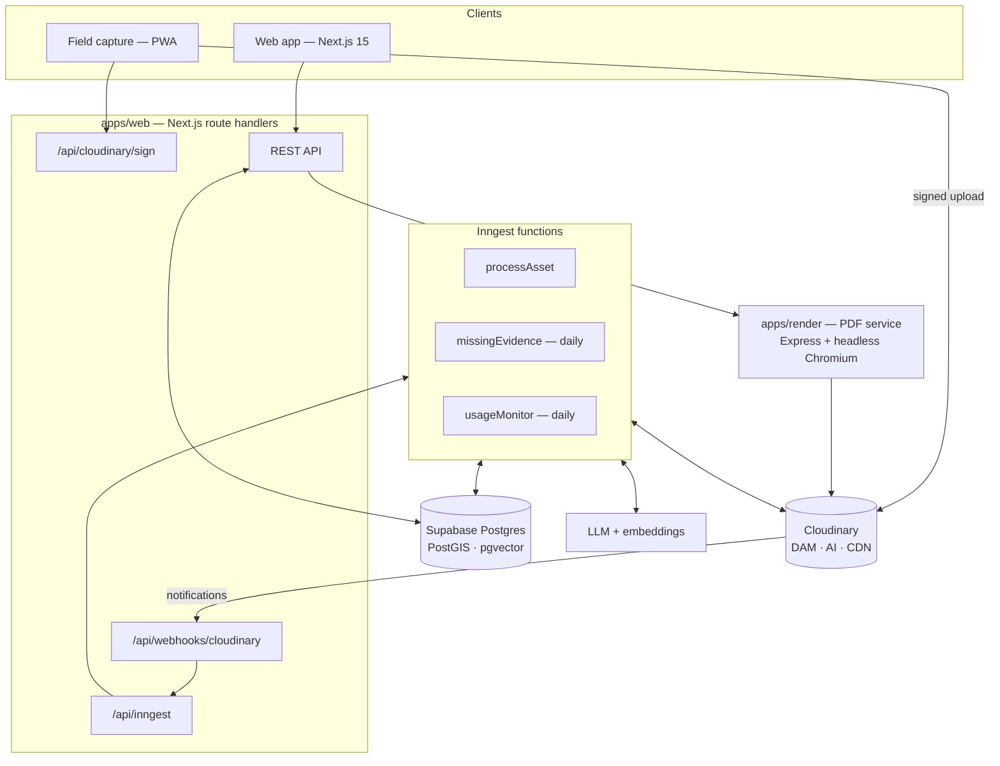

<div align="center">

# Pluribus

### The trust layer for social-sector spending

**AI-powered evidence vault that turns raw field photos and videos into verified, searchable, audit-ready proof of impact — built on Cloudinary.**

[](https://cloudinary.com)
[](https://nextjs.org)
[](https://www.typescriptlang.org)
[](https://supabase.com)
[](https://www.inngest.com)
[](#project-status)

[Overview](#overview) ·
[How it works](#how-it-works) ·
[Cloudinary integration](#cloudinary-integration) ·
[Architecture](#architecture) ·
[Getting started](#getting-started) ·
[API](#api-reference) ·
[Roadmap](#roadmap)

</div>

---

## Overview

Indian companies covered by **Section 135 of the Companies Act, 2013** direct tens of thousands of crores into CSR programmes every year through NGO partners. The proof that this money created impact usually arrives as unstructured photos on WhatsApp, shared drives and PDFs. It is:

- **Unverifiable.** The same photo is reused across projects and years. Location and date can't be trusted.
- **Unsearchable.** Nobody can answer *"show me every handwashing station we funded in Barmer"*.
- **Slow to report.** Annual CSR annexures and impact-assessment packs take weeks to assemble by hand.
- **Untraceable.** An image in a published report can't be traced back to its original field capture.

**Pluribus** is a media-first evidence platform that fixes this. It captures field media with provenance, **understands** it with Cloudinary AI, **organises** it by grant → project → site → milestone, **verifies** it with an explainable trust score, **compares** before and after images, and **generates** compliance-grade reports in which every claim cites the evidence behind it.

> *Every rupee of CSR, backed by verifiable visual evidence.*

### Who it's for

| Persona | What Pluribus gives them |
|---|---|
| **Corporate CSR head** | Portfolio-wide view of funded projects, trustworthy evidence, board and annual-report outputs |
| **NGO programme manager** | Automatic organisation of field media and one-click funder updates |
| **Field worker** | Fast capture with GPS and timestamp; no manual tagging |
| **Impact assessor / auditor** | Tamper-flagged, traceable evidence with full lineage; fewer site visits |

---

## Key capabilities

<table>
<tr>
<td width="50%" valign="top">

### Trust score engine
An explainable 0–100 score for every asset:
- **Photo-reuse detection** using Cloudinary perceptual hashes (pHash)
- **Geofence verification** against site polygons, with tolerance bands for GPS drift
- **Time consistency** across EXIF capture time, device time and the grant period
- **EXIF integrity** checks, including editing-software signatures
- **Burst-shot exemption**, so legitimate repeat shots aren't flagged

Assets are banded **Verified** (≥75), **Needs review** (50–74) or **Flagged** (<50). Flagged assets are excluded from reports automatically.

</td>
<td width="50%" valign="top">

### Auto-assignment
Each upload is matched to the correct **project, site and milestone** by weighting:
- geofence containment and proximity (0.5)
- activity-tag overlap (0.3)
- milestone date fit (0.2)

Confident matches (≥0.75) are assigned automatically. The rest go to a review inbox with the top three suggestions.

</td>
</tr>
<tr>
<td valign="top">

### Before/after engine
- Pairs baseline and completion photos from the same site (≥14 days apart, visually similar)
- Builds **signed side-by-side composites entirely with Cloudinary transformations**, with no server-side image processing
- Produces a structured change summary: added, removed and improved items, count deltas and a narrative

</td>
<td valign="top">

### Hybrid semantic search
- Natural-language queries are parsed into structured filters (activity, state, district, date, trust)
- Ranking blends vector similarity, trust score, quality, recency and keyword hits
- Every result explains **why it matched**

</td>
</tr>
<tr>
<td valign="top">

### Grounded report generator
- Diversity-aware evidence selection (MMR) across sites and milestones
- The narrative is grounded in a **facts bundle**, and a **citation validator** rejects any claim without an `[asset:ID]` reference
- A dedicated render service produces the **PDF**, with QR codes that link each image to its evidence page

</td>
<td valign="top">

### End-to-end provenance
A lineage graph for every asset:
**Original (public_id + version) → Cloudinary transformations → derivatives → outputs** (reports, reels, before/after pairs).
Versioned, signed URLs make each link tamper-evident.

</td>
</tr>
</table>

---

## How it works



1. **Capture.** Field teams upload through a signed Cloudinary upload preset. GPS, capture time and uploader travel as contextual metadata.
2. **Understand.** Cloudinary returns tags, detected objects, OCR text, image metadata, quality analysis and a perceptual hash at upload time. AI Vision maps each asset to a CSR activity taxonomy of about 40 activities aligned to Schedule VII.
3. **Organise and verify.** A background pipeline assigns the asset and computes its trust score, then writes the results back to Cloudinary as structured metadata, so the media library and the app stay in sync.
4. **Compare and report.** Before/after pairs, reports and campaign reels are generated as Cloudinary derivatives, and each one is recorded in the lineage graph.

---

## Cloudinary integration

Cloudinary is the **media system of record** for Pluribus: storage, AI understanding, transformation, delivery and integrity. All Cloudinary code is isolated in [`packages/media`](packages/media).

| Capability | Cloudinary feature | Used for |
|---|---|---|
| Ingestion | Signed **Upload API** + **Upload Presets** | Field capture with enforced analysis settings |
| Organisation | **Asset folders**, **tags**, **Structured Metadata** (13 fields), contextual metadata | Grant → project → site → milestone hierarchy; filterable trust fields |
| Understanding | **AI Vision** (tagging, Q&A), **AI Content Analysis** (auto-tagging, object detection), **OCR** | Activity taxonomy, milestone verification, signboard text |
| Verification | **`phash`**, **image metadata (EXIF)**, **quality analysis** | Photo-reuse detection, time and GPS checks, best-evidence selection |
| Transformation | `g_auto`, `c_fill`, `c_pad`, layers (`l_`, `l_text`, `fl_layer_apply`), `e_improve`, `f_auto`, `q_auto` | Thumbnails, report images, before/after composites, provenance stamps |
| Privacy | `e_blur_faces` / `e_pixelate_faces` in a named public transformation | Beneficiary protection in every shared output |
| Video | `e_preview`, `fl_splice`, `ar_9:16` | Campaign reels built from verified evidence |
| Discovery | **Search API** expressions on structured metadata and tags | Faceted search alongside vector search |
| Integrity | **Signed URLs**, **named transformations**, versioned delivery | Tamper-evident lineage from original to report |
| Automation | **Webhooks** (`notification_url`), eager/async derivatives | Event-driven processing pipeline |

Provisioning is fully scripted and idempotent. [`scripts/cloudinary-setup.ts`](scripts/cloudinary-setup.ts) creates the structured metadata schema, named transformations and upload presets.

<details>
<summary><b>Example: before/after composite built entirely from a URL</b></summary>

```text
https://res.cloudinary.com/<cloud>/image/upload/
  c_fill,g_auto,w_800,h_600/
  c_pad,w_1600,h_600,g_west,b_black/
  l_<after_public_id>/c_fill,g_auto,w_800,h_600/fl_layer_apply,g_east/
  l_text:Arial_36_bold:BEFORE,co_white,b_rgb:00000099/fl_layer_apply,g_north_west,x_16,y_16/
  l_text:Arial_36_bold:AFTER,co_white,b_rgb:00000099/fl_layer_apply,g_north_east,x_16,y_16/
  e_blur_faces/q_auto/f_jpg/
  v<version>/<before_public_id>
```

The server generates and signs these URLs, so no one can alter the transformation.

</details>

---

## Architecture



### Repository layout

```text
pluribus/
├── apps/
│   ├── web/            Next.js 15 App Router — API routes, Inngest functions
│   └── render/         PDF render service (report templates, QR codes)
├── packages/
│   ├── core/           Pure domain logic — trust, assignment, pairing, reports, stories, rate limiting
│   ├── media/          Cloudinary integration — uploads, webhooks, URL builders, AI Vision, metadata, search
│   ├── ai/             LLM and embedding providers, zod schemas
│   └── db/             Types, repository interface, seed dataset
├── supabase/
│   ├── migrations/     Schema — PostGIS geofences, pgvector (HNSW), RPCs
│   └── seed.sql        Sample CSR grants across Rajasthan, Maharashtra and Bihar
├── scripts/
│   ├── cloudinary-setup.ts   Idempotent Cloudinary provisioning
│   └── eval/                 Duplicate, assignment and search evaluation harnesses
├── prd.md                    Product requirements
└── implementation_plan.md    Phased build plan
```

### Tech stack

| Layer | Technology |
|---|---|
| Media platform | Cloudinary (Node SDK v2) |
| Application | Next.js 15, React 19, TypeScript (strict) |
| Data | Supabase — Postgres, PostGIS, pgvector |
| Background jobs | Inngest (event-driven and scheduled functions) |
| Validation | zod |
| AI | Cloudinary AI Vision; LLM and embedding providers behind interfaces |
| Rendering | Express + headless Chromium (PDF), `qrcode` |
| Tooling | pnpm workspaces, Turborepo, Vitest, tsx |

---

## Getting started

### Prerequisites

- Node.js **20+** and **pnpm 9+**
- A **Cloudinary** account (free tier works; enable AI Vision, OCR and moderation add-ons for the full pipeline)
- A **Supabase** project (optional for local development)
- An LLM / embeddings API key (optional; the pipeline falls back to labelled rule-based modes)

### Installation

```bash
git clone https://github.com/Shreyy8/Sustainablity_SA.git pluribus
cd pluribus
pnpm install
cp .env.example .env
```

### Configuration

| Variable | Purpose |
|---|---|
| `CLOUDINARY_CLOUD_NAME`, `CLOUDINARY_API_KEY`, `CLOUDINARY_API_SECRET` | Cloudinary credentials (server-side only) |
| `NEXT_PUBLIC_CLOUDINARY_CLOUD_NAME` | Public cloud name for delivery URLs |
| `CLOUDINARY_UPLOAD_PRESET_IMAGE` / `_VIDEO` | Signed upload presets created by the setup script |
| `CLOUDINARY_NOTIFICATION_URL` | Public URL of `/api/webhooks/cloudinary` |
| `SUPABASE_URL`, `SUPABASE_ANON_KEY`, `SUPABASE_SERVICE_ROLE_KEY` | Database access |
| `ANTHROPIC_API_KEY` / `OPENAI_API_KEY`, `EMBEDDINGS_API_KEY` | LLM reasoning and embeddings |
| `APP_BASE_URL` | Base URL used in report QR codes and evidence links |

### Provision Cloudinary and run

```bash
pnpm setup:cld      # create structured metadata, named transformations, upload presets
pnpm dev            # start the web app and API on http://localhost:3000
```

To receive Cloudinary webhooks locally, expose port 3000 with a tunnel (for example `cloudflared` or `ngrok`) and set `CLOUDINARY_NOTIFICATION_URL` to the tunnel URL.

### Scripts

| Command | Description |
|---|---|
| `pnpm dev` | Run the Next.js app and API |
| `pnpm build` | Build all workspace packages |
| `pnpm test` | Run unit tests (Vitest) |
| `pnpm setup:cld` | Provision Cloudinary (idempotent) |
| `pnpm eval:dup` | Duplicate-detection evaluation |
| `pnpm eval:assign` | Auto-assignment evaluation |
| `pnpm eval:search` | Search relevance evaluation |
| `pnpm eval:all` | Run all evaluations |

---

## API reference

| Method | Endpoint | Description |
|---|---|---|
| `POST` | `/api/cloudinary/sign` | Sign upload parameters for a signed Cloudinary upload |
| `POST` | `/api/webhooks/cloudinary` | Receive Cloudinary notifications (signature-verified) |
| `GET/POST` | `/api/inngest` | Inngest function endpoint |
| `GET/POST` | `/api/assets` | List or register assets |
| `GET/PATCH` | `/api/assets/:id` | Asset detail with AI enrichment and trust breakdown; reassign or reject |
| `GET` | `/api/assets/:id/lineage` | Provenance graph (original → derivatives → outputs) |
| `GET` | `/api/projects/:id/timeline` | Evidence grouped by milestone and date |
| `GET` | `/api/projects/:id/map` | Site geofences and asset locations as GeoJSON |
| `GET` | `/api/search` | Hybrid natural-language and faceted search |
| `GET/POST` | `/api/pairs`, `/api/pairs/:id` | Before/after pairs and composites |
| `GET` | `/api/review` | Review inbox queues |
| `GET` | `/api/dashboard` | Portfolio KPIs |
| `POST` | `/api/reports`, `/api/reports/:id/publish` | Generate and publish grounded reports |
| `POST` | `/api/stories` | Generate campaign reels from verified evidence |

---

## Evaluation

Pluribus ships with reproducible evaluation harnesses for its core decision logic. They currently run against the **bundled synthetic seed dataset (fixture mode)**. Live-mode results on real Cloudinary-processed media will be published as the pipeline is connected end to end.

| Metric | Target | Fixture-mode result | Command |
|---|---|---|---|
| Unit tests | 100% pass | 18 / 18 | `pnpm test` |
| Duplicate recall | ≥ 95% | 100% | `pnpm eval:dup` |
| Duplicate precision | ≥ 90% | 100% | `pnpm eval:dup` |
| Burst false alarms | 0 | 0 | `pnpm eval:dup` |
| Auto-assignment accuracy | ≥ 80% | 100% | `pnpm eval:assign` |
| Search hit@5 (20 queries) | ≥ 80% | 100% | `pnpm eval:search` |

---

## Security and privacy

- **Signed uploads only.** The API secret never reaches the client.
- **Webhook verification.** Cloudinary notification signatures are checked, with a timestamp tolerance.
- **Tamper-evident delivery.** Dynamic transformations are served through signed, versioned URLs.
- **Beneficiary protection.** Public outputs use a face-blurring named transformation by default.
- **Rate limiting.** A sliding-window limiter is available for API routes (Upstash Redis or in-memory).
- **Data residency.** The target deployment uses India-region infrastructure, aligned with the Digital Personal Data Protection Act, 2023.

---

## Project status

Pluribus is in **active development**. The backend covers the domain engines, Cloudinary integration, background jobs and the PDF render service. The web interface is under construction.

## Roadmap

- [x] Trust score engine, auto-assignment, before/after pairing, citation validator
- [x] Cloudinary provisioning, signed uploads, webhooks, composite and reel URL builders
- [x] Inngest pipeline and scheduled jobs; PDF render service
- [ ] Web interface: capture, project timeline and map, search, before/after studio, evidence pages
- [ ] Supabase persistence with row-level security, replacing the in-memory store
- [ ] Live Cloudinary AI Vision and LLM enrichment across the full pipeline
- [ ] **Evidence mode vs story mode**: generative AI allowed only on clearly labelled campaign content
- [ ] **Site timelapses** built from verified evidence
- [ ] **Green media meter**: bytes and estimated CO₂ saved through Cloudinary optimisation
- [ ] Offline-first field capture and Hindi localisation

See [`prd.md`](prd.md) and [`implementation_plan.md`](implementation_plan.md) for the full specification.

---

## Contributing

Contributions are welcome. Please open an issue to discuss significant changes before submitting a pull request, and make sure `pnpm test` and `pnpm eval:all` pass.

## License

License to be confirmed. Until a `LICENSE` file is added, all rights are reserved by the authors.

## Acknowledgements

Built for the **Cloudinary hackathon track**, with Cloudinary's programmable media platform at its core.

<div align="center">
<sub>Pluribus — every rupee of CSR, backed by verifiable visual evidence.</sub>
</div>
