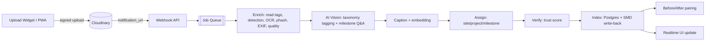
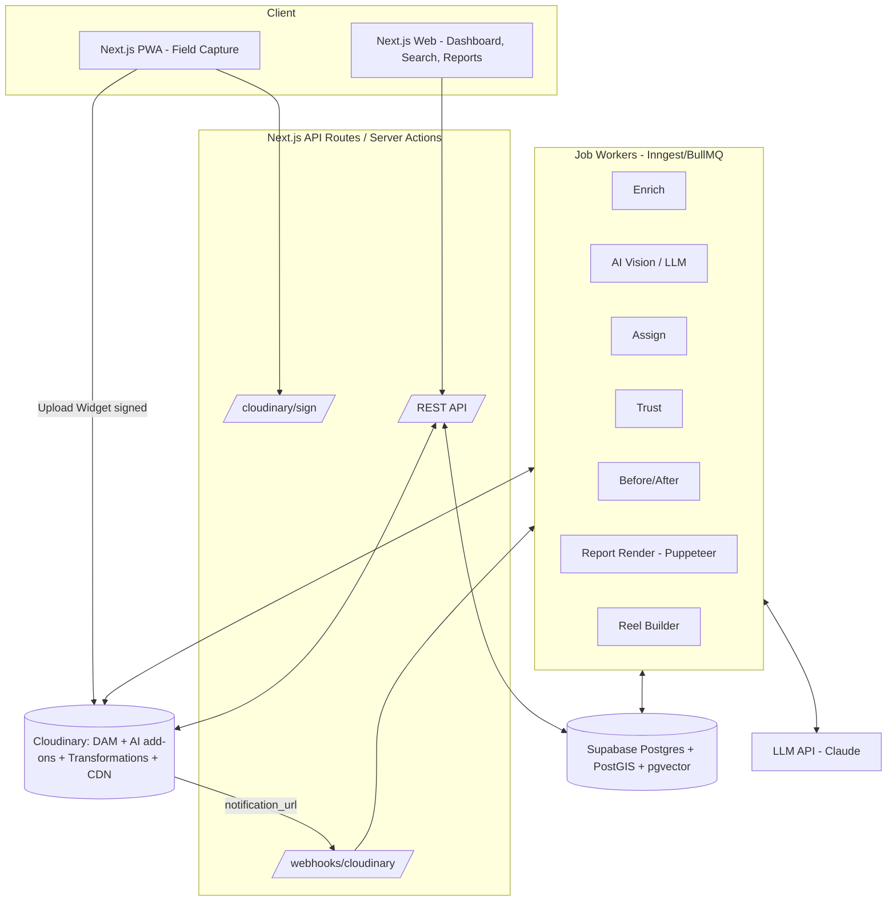

# PRD AI-Powered CSR Evidence Vault

| Field | Value |
|---|---|
| Document | Product Requirements Document (v1.0) |
| Status | Draft, ready to build |
| Owner | Shreyansh|
| Last updated | 28 Sep 2026 |
| Core platform | Cloudinary (media storage, AI, transformation, delivery) |
| Build target | Hackathon MVP (36–48 h), then a 12-week product roadmap |

---

## 1. Overview

### 1.1 Problem
Indian companies covered by the CSR mandate (Companies Act §135) spend tens of thousands of crores every year through NGO partners. NSE-listed companies alone spent ₹22,212 Cr in FY25. Proof of impact arrives as unstructured photos and videos over WhatsApp, Google Drive and PDFs. That causes four problems:

- **It can't be verified.** Photos get reused across projects and years, and GPS and dates don't match.
- **It can't be searched.** Nobody can answer "show me every handwashing station we funded in Rajasthan".
- **Reporting is slow.** CSR annual-report annexures, impact-assessment packs and donor updates take weeks to assemble by hand.
- **There is no traceability.** A report image can't be traced back to its original field capture.

### 1.2 Solution
Saakshi is a media-first evidence platform. It **captures** field media with provenance, then uses **Cloudinary AI to understand** it, **organizes** it by company → NGO → project → site → milestone, **verifies** it with a trust score, **compares** before and after images, and **generates** compliance reports and campaign content. Every output stays traceable to its original asset.

### 1.3 Vision
Become the trust layer for social-sector spending in India. When a company says "we built 40 classrooms", the claim should come with evidence anyone can check.

---

## 2. Goals, non-goals and success metrics

### 2.1 Goals
| # | Goal |
|---|---|
| G1 | Automatically classify and organize ≥85% of uploaded media into the correct project and site, with no manual tagging |
| G2 | Flag reused, out-of-geofence and time-inconsistent evidence before it reaches a report |
| G3 | Produce before/after comparisons with AI-written change summaries |
| G4 | Cut CSR report preparation from weeks to minutes |
| G5 | Make every asset findable through natural-language and faceted search |
| G6 | Preserve full lineage from original asset to transformation to report or reel |

### 2.2 Non-goals (v1)
- Fund disbursement or payments
- Finding and matching NGOs to companies (existing CSR platforms already do this)
- Drone or satellite imagery processing (P2)
- Native iOS/Android apps (the PWA covers v1)

### 2.3 Success metrics
| Metric | Hackathon target | 6-month product target |
|---|---|---|
| Auto-assignment accuracy (project/site) | ≥80% on seed set | ≥90% |
| Duplicate detection recall (reused photos) | ≥95% on seeded duplicates | ≥95% |
| Time to generate a project report | <60 s | <60 s |
| Search relevance (top-5 hit rate) | ≥80% on 20 demo queries | ≥85% |
| NGO upload time (per item, median) | <30 s | <20 s |
| Paying corporate accounts | – | 5 |

---

## 3. Personas

| Persona | Description | Top jobs to be done |
|---|---|---|
| **Field worker (Ravi)** | NGO staff in a village, low-end Android phone, patchy connectivity, speaks Hindi | Capture evidence quickly, work offline, record voice notes in his language |
| **NGO program manager (Meena)** | Runs 5–15 projects for 3 corporate funders | Keep media organized, send reports without manual collation, look credible |
| **Corporate CSR head (Arjun)** — **buyer** | Manages ₹20 Cr/yr across 25 NGOs | Portfolio visibility, trustworthy proof, board and annual-report outputs |
| **Impact assessor (Priya)** | Third-party evaluator | Traceable, tamper-flagged evidence; fewer site visits |
| **Comms / fundraising lead (Sana)** | NGO or company communications | Ready-to-post reels and impact stories |

---

## 4. Key user journeys

### J1 — Field capture (Ravi)
1. Ravi opens the PWA. It remembers his assigned projects and sites.
2. He taps **Capture**, picks a milestone (e.g. "Classroom — Roofing") and takes photos or video. GPS and the device timestamp are recorded automatically.
3. He can hold to record a voice note (Hindi).
4. If he's offline, items queue in IndexedDB and upload in the background when the connection returns.
5. He sees "✓ Uploaded · Verified" or a warning ("Location outside site boundary").

### J2 — Automatic organization (system)
1. The asset lands in Cloudinary through a signed upload preset. Tags, detection, OCR, phash and metadata are requested at upload.
2. A webhook fires and the pipeline runs: enrich → assign → verify → embed → index.
3. The asset appears on the project timeline and map, with its tags and trust score.

### J3 — Review queue (Meena)
1. Low-confidence assignments and flagged assets appear in the **Review** inbox.
2. Meena confirms or reassigns with one click. Each correction is logged and improves the per-project tag profile.

### J4 — Portfolio oversight (Arjun)
1. The dashboard shows spend-weighted projects on a map, evidence coverage per milestone, trust-score distribution and flagged items.
2. Arjun drills into a project and sees the timeline, before/after pairs and the AI summary.

### J5 — Report generation (Meena / Arjun)
1. Arjun picks a report template (CSR Annual Annexure, Quarterly Funder Update or Impact Assessment Pack), a scope and a date range.
2. The system selects the best evidence (high trust, high quality, milestone coverage), writes the narrative and renders a PDF.
3. Each image in the PDF carries a QR code or link to its **Evidence Page**, which shows the original, the metadata, the trust checks and the lineage.

### J6 — Campaign story (Sana)
1. Sana picks a project and a format (30-s 9:16 reel, LinkedIn carousel or web story).
2. The system assembles clips and images, adds captions and branding, and blurs faces by default.
3. She exports the result or copies a delivery URL.

### J7 — Audit (Priya)
1. Priya opens a shared read-only **Audit Room** for a grant.
2. She filters by trust flags, inspects lineage and adds comments or sign-offs.

---

## 5. Scope and prioritization

| ID | Feature | P0 (hackathon MVP) | P1 (weeks 1–6) | P2 (weeks 7–12) |
|---|---|:-:|:-:|:-:|
| F1 | Org/Grant/Project/Site/Milestone setup (with geofence drawing) | ✅ | | |
| F2 | PWA capture + Cloudinary Upload Widget | ✅ | Offline queue | Voice notes (regional) |
| F3 | AI enrichment (tags, objects, captions, OCR) | ✅ | Custom activity taxonomy | Fine-tuned activity classifier |
| F4 | Auto-assignment to project/site/milestone | ✅ | Active-learning from corrections | |
| F5 | Trust score (phash duplicates, geofence, time, EXIF) | ✅ | AI-generated-image detection | Cross-tenant duplicate network |
| F6 | Before/after pairing + slider + AI change summary | ✅ | Auto-alignment | Quantified change (e.g. green-cover %) |
| F7 | Semantic + faceted search | ✅ | Search by image | Saved searches / alerts |
| F8 | Report generator (PDF) | ✅ 1 template | 3 templates, BRSR export | Custom templates |
| F9 | Reel / story generator | ✅ basic | Branded templates | Multilingual subtitles |
| F10 | Evidence page + lineage graph | ✅ | Signed public share links | Audit sign-off workflow |
| F11 | Review inbox | ✅ basic | Bulk actions | |
| F12 | Corporate portfolio dashboard | ✅ | Spend vs evidence coverage | Benchmarks |
| F13 | Privacy (face blur, consent flags) | ✅ blur in outputs | Consent capture | DPDP data-subject requests |
| F14 | Roles & permissions (RLS) | ✅ basic | Full RBAC | SSO |
| F15 | Schedule VII & SDG mapping | | ✅ | |
| F16 | Integrations (API, webhooks out) | | | ✅ |

---

## 6. Functional requirements

### 6.1 Organization and project setup (F1)
- **FR-1.1** Tenants are `Organization`s of type `CORPORATE`, `NGO` or `ASSESSOR`.
- **FR-1.2** A `Grant` links one corporate and one NGO, with an amount, a period and a Schedule VII category.
- **FR-1.3** A `Project` belongs to a grant and has name, description, activity type(s), state/district and expected milestones.
- **FR-1.4** A `Site` belongs to a project and has a **geofence polygon** (drawn on a map or given as centre + radius) and an optional baseline date.
- **FR-1.5** A `Milestone` has a name, an expected date and the expected visual signals (e.g. `["roof","walls","classroom"]`). These signals help assignment and coverage scoring.
- **FR-1.6** Each project gets a Cloudinary asset folder: `saakshi/{corp_slug}/{ngo_slug}/{project_slug}/{site_slug}`.

### 6.2 Capture and upload (F2)
- **FR-2.1** Uploads use the **Cloudinary Upload Widget** (web and PWA) with **signed** uploads. The backend issues the signature via `/api/cloudinary/sign`.
- **FR-2.2** The client captures `navigator.geolocation` (lat, lng, accuracy) and `capturedAt`. Values go into Cloudinary **contextual metadata** and **structured metadata**.
- **FR-2.3** Supported types: JPG/PNG/HEIC/WebP images, MP4/MOV videos (≤200 MB, ≤5 min in v1), M4A/WebM voice notes.
- **FR-2.4** Offline (P1): a service worker queues blobs in IndexedDB and uses Background Sync, retrying with exponential backoff.
- **FR-2.5** Bulk upload from desktop (zip or folder drag). The system reads EXIF GPS and time from the files.
- **FR-2.6** After upload, the user sees processing status in real time (Supabase Realtime channel `asset:{id}`).

### 6.3 AI enrichment (F3)
- **FR-3.1** Each image gets: general tags, object detection (with counts), a caption, OCR text (for signboards and plaques), quality score and moderation status.
- **FR-3.2** Each video gets: a transcript, per-segment tags, a representative thumbnail, and an AI preview clip.
- **FR-3.3** Each asset is mapped to the Saakshi **activity taxonomy** (≈40 activities across 8 domains: Education, WASH, Health, Environment, Livelihood, Infrastructure, Energy, Community). §8.3 describes how.
- **FR-3.4** Enrichment results are stored both in Cloudinary (tags and metadata, for DAM search) and in Postgres (for app logic).

### 6.4 Auto-assignment (F4)
- **FR-4.1** Candidate sites are those whose geofence contains the GPS point, or lies within 500 m of it (buffer).
- **FR-4.2** Candidates are ranked by: geofence hit (0.5), activity-tag overlap with the project (0.3), and date within the grant period and next expected milestone (0.2).
- **FR-4.3** If the top score is ≥0.75, assign automatically. Otherwise send the asset to the Review Inbox with its top 3 suggestions.
- **FR-4.4** Milestone assignment uses the overlap between asset tags and each milestone's expected signals, plus closeness to the milestone date.

### 6.5 Trust score (F5)
The score runs from 0 to 100. Every check is stored and explainable. Full algorithm in §9.
- **FR-5.1** Duplicate or near-duplicate detection within a tenant (and across tenants in P2) using the Cloudinary `phash`.
- **FR-5.2** Geofence check.
- **FR-5.3** Time consistency: EXIF DateTimeOriginal vs device capture time vs upload time vs grant period.
- **FR-5.4** EXIF presence and integrity (missing camera model, a software field showing an editor, etc.).
- **FR-5.5** (P1) Likelihood that the image is AI-generated or manipulated.
- **FR-5.6** Assets scoring below 50 are **excluded from reports by default** and flagged in red.

### 6.6 Before/after (F6)
- **FR-6.1** Pairs are proposed automatically: same site, overlapping tags, ≥14 days apart, similar viewpoint (embedding similarity ≥ threshold).
- **FR-6.2** Users can also create pairs manually.
- **FR-6.3** A side-by-side composite and a slider view are built with Cloudinary transformations. No server-side image processing.
- **FR-6.4** An AI change summary gives structured deltas (e.g. `{"added":["roof","paint"],"counts":{"students":{"before":0,"after":38}}}`) plus a narrative.

### 6.7 Search (F7)
- **FR-7.1** Natural-language search: "girls using new toilets in Barmer after March".
- **FR-7.2** Facets: organization, project, site, activity, milestone, date range, trust band, media type, state/district.
- **FR-7.3** Search by image (P1): upload a photo and find similar evidence.
- **FR-7.4** Results respect RLS. A user only sees assets from grants they can access.

### 6.8 Reports (F8)
- **FR-8.1** Templates:
  - *Quarterly Funder Update* (P0)
  - *CSR Annual Annexure* (P1)
  - *Impact Assessment Evidence Pack* (P1)
  - *BRSR Social Section export* (P1)
- **FR-8.2** Evidence selection: highest trust × quality, diversity across milestones and sites, and ≥1 before/after pair per project where one exists.
- **FR-8.3** An LLM writes the narrative, grounded only in stored metadata. Every claim cites asset IDs, and a validator rejects claims without a citation (§11).
- **FR-8.4** The PDF includes, per image: a caption, date, site, trust badge and QR code to the Evidence Page.
- **FR-8.5** Reports are versioned and immutable once "published". Each report stores the exact asset IDs, versions and transformation URLs it used.

### 6.9 Story / reel generator (F9)
- **FR-9.1** Formats: 9:16 reel (15–60 s), 1:1 carousel (5–10 slides), 16:9 highlight.
- **FR-9.2** Assembled with Cloudinary video transformations: splice clips, add image slides, text overlays, auto-crop to the aspect ratio, and a logo and outro card.
- **FR-9.3** Faces are blurred by default (`e_blur_faces`). An override requires a recorded consent flag.
- **FR-9.4** The LLM generates the script and captions. Subtitles come from the transcript.

### 6.10 Evidence page and lineage (F10)
- **FR-10.1** Each asset has a page at `/e/{short_id}` showing: the original (signed URL), metadata, AI tags, the trust breakdown, map pin, related before/after pairs, and every derivative and report that uses it.
- **FR-10.2** A lineage graph runs: Original (public_id + version) → Derivatives (transformation strings) → Outputs (reports, reels).
- **FR-10.3** Public share links are signed and expiring. A public viewer sees blurred faces.

### 6.11 Review inbox (F11)
- **FR-11.1** Queues: *Unassigned*, *Low trust*, *Possible duplicate*, *Moderation*, *Missing milestone evidence*.
- **FR-11.2** Actions: assign, reassign, mark as legitimate duplicate (e.g. the same signboard), reject, and request re-capture (which notifies the field worker).
- **FR-11.3** Every action is written to `audit_log`.

### 6.12 Corporate dashboard (F12)
- **FR-12.1** KPIs: active projects, assets this quarter, % milestones with evidence, average trust score, flagged items.
- **FR-12.2** A map of all sites, coloured by evidence freshness (green <30 days, amber 30–90, red >90).
- **FR-12.3** A per-NGO scorecard covering responsiveness, trust average and coverage.

---

## 7. Cloudinary integration specification

Cloudinary is the **media system of record**. Postgres holds the relational and business model and mirrors the key Cloudinary fields.

### 7.1 Cloudinary products and features used

| Capability | Cloudinary feature | Used for |
|---|---|---|
| Ingestion | **Upload Widget**, Upload API (signed), **Upload Presets** | Field capture, bulk upload |
| Organization | **Asset folders**, **tags**, **Structured Metadata (SMD)**, **Contextual metadata** | Project hierarchy, filterable fields |
| Image understanding | **Cloudinary AI Content Analysis add-on** (auto-tagging, object detection, captioning) | Tags, counts, captions |
| Image understanding (Q&A) | **Cloudinary AI Vision add-on** (Tagging, Moderation and General/Q&A modes) | Custom taxonomy tagging, change questions, activity checks |
| Third-party taggers (optional) | Google Auto Tagging / AWS Rekognition / Imagga add-ons | Backup or ensemble tagging |
| Text in images | **OCR Text Detection add-on** (`adv_ocr`) | Signboards, plaques, beneficiary boards |
| Duplicates | **`phash: true`** upload parameter | Perceptual-hash duplicate detection |
| EXIF/GPS | **`media_metadata: true`** (image metadata) | Time and GPS consistency checks |
| Quality | **`quality_analysis: true`** | Choosing the best evidence for reports |
| Moderation | **AWS Rekognition moderation** or **AI Vision Moderation mode** | Screening inappropriate content |
| Video transcription | **Google AI Video Transcription add-on** (`raw_convert: "google_speech"`) | Subtitles, searchable speech |
| Video summarization | **AI-based video preview** (`e_preview`) | Reel clips, thumbnails |
| Smart crop | **`g_auto`**, `c_fill`, `ar_9:16` | Reels, carousels, report thumbnails |
| Privacy | **`e_blur_faces`**, **`e_pixelate_faces`** | Protecting beneficiaries in public outputs |
| Compositing | **Layers** (`l_`, `l_text:`, `fl_layer_apply`), `c_pad` | Before/after composites, provenance stamps |
| Video assembly | **`fl_splice`**, `du_`, `so_`/`eo_`, `e_fade`, image-to-video layers | Reels |
| Enhancement | `e_improve`, `e_auto_brightness`, `q_auto`, `f_auto` | Clean report visuals, fast delivery |
| Discovery | **Search API** (Lucene-style expressions, aggregations), **Visual Search** (text or image) | Faceted and semantic search |
| Integrity | **Signed delivery URLs** (`s--…--`), **Strict transformations**, versioned URLs (`v<version>`) | Tamper-evident lineage |
| Async processing | **`notification_url` webhooks**, `eager` + `eager_async` | Pipeline triggers, pre-generated derivatives |
| Playback | **Cloudinary Video Player** | Evidence page, project page |
| Admin browsing | **Media Library Widget** | NGO/corporate admins browsing the DAM |
| Backup | **Backup** setting on the product environment | Keeping originals safe |

> ⚠️ Add-ons have to be enabled on the Cloudinary product environment and have their own quotas. For the hackathon, use the free tier plus add-on free quotas, and fall back to an LLM vision model for any add-on that isn't available (§8.4). Check exact parameter names against the current Cloudinary docs while building.

### 7.2 Structured metadata schema (create once via the Admin API)

| external_id | Type | Notes |
|---|---|---|
| `sk_org_corp` | string | Corporate slug |
| `sk_org_ngo` | string | NGO slug |
| `sk_project` | string | Project ID |
| `sk_site` | string | Site ID |
| `sk_milestone` | string | Milestone ID |
| `sk_activity` | set (enum) | Activity taxonomy values |
| `sk_captured_at` | date | Device capture time |
| `sk_lat` / `sk_lng` | number | Capture GPS |
| `sk_trust` | integer | 0–100 |
| `sk_trust_band` | enum | `verified` / `review` / `flagged` |
| `sk_consent` | enum | `none` / `verbal` / `written` |
| `sk_status` | enum | `pending` / `assigned` / `rejected` |

Contextual metadata (free-form) holds: `caption`, `uploader_id`, `device`, `gps_accuracy`, `voice_note_id`.

### 7.3 Upload preset: `saakshi_field_signed`

```json
{
  "name": "saakshi_field_signed",
  "unsigned": false,
  "use_asset_folder_as_public_id_prefix": true,
  "unique_filename": true,
  "overwrite": false,
  "phash": true,
  "media_metadata": true,
  "quality_analysis": true,
  "detection": "coco_v2",
  "auto_tagging": 0.6,
  "categorization": "google_tagging",
  "ocr": "adv_ocr",
  "moderation": "aws_rek",
  "notification_url": "https://api.saakshi.app/webhooks/cloudinary",
  "eager_async": true,
  "eager": [
    { "transformation": "c_fill,g_auto,w_400,h_300/q_auto,f_auto" },
    { "transformation": "c_limit,w_1600/e_improve/q_auto,f_auto" }
  ]
}
```

Video preset `saakshi_video_signed` adds:
```json
{
  "resource_type": "video",
  "raw_convert": "google_speech:srt:vtt",
  "eager": [
    { "transformation": "e_preview:duration_12/c_fill,g_auto,ar_9:16,w_720/q_auto" },
    { "transformation": "so_auto/c_fill,g_auto,w_400,h_300/f_jpg" }
  ],
  "eager_async": true
}
```

The client passes these dynamic params with each upload: `asset_folder`, `tags` (`sk:project:{id}`, `sk:pending`), `context` (GPS, capturedAt, uploader) and `metadata` (SMD values that are already known).

### 7.4 AI Vision usage

| Mode | Prompt / config | Output use |
|---|---|---|
| **Tagging** | Pass Saakshi's activity taxonomy as the tag list, each tag with a short description (e.g. `borewell: "a hand pump or borewell with pipe and platform"`) | `sk_activity` values plus confidence |
| **Moderation** | Questions: "Does the image contain nudity or violence?", "Is a child's face clearly identifiable?" | Moderation queue, consent requirement |
| **General (Q&A)** | Per-milestone questions such as "Is the classroom roof complete?", "How many people are visible?", "Is there a signboard naming a company or NGO?" | Milestone verification and counts |
| **General on composite** | Send the **side-by-side before/after composite URL** (§10) with "List visible changes from left (before) to right (after)" | Change summary input |

All AI Vision calls go through a server-side queue with rate limiting and results caching, keyed on `asset_id + prompt_hash`.

### 7.5 Webhook handling
Endpoint: `POST /webhooks/cloudinary`
1. Verify the `X-Cld-Signature` and `X-Cld-Timestamp` headers with the API secret, and reject anything older than 10 minutes.
2. Handle `notification_type` values: `upload`, `eager`, `info` (add-on completion, e.g. transcription), `moderation`.
3. Handling is idempotent on `asset_id + notification_type + version`.
4. Enqueue a job: `asset.enrich` → `asset.assign` → `asset.verify` → `asset.embed` → `asset.index`.

### 7.6 Transformation cookbook (named transformations)

Create these as **named transformations** (`t_…`) and turn on **Strict Transformations** so only whitelisted derivatives can be generated.

| Name | Transformation | Purpose |
|---|---|---|
| `t_sk_thumb` | `c_fill,g_auto,w_400,h_300/q_auto/f_auto` | Grid thumbnails |
| `t_sk_report` | `c_limit,w_1600/e_improve/q_auto:good/f_jpg` | PDF images |
| `t_sk_public` | `e_blur_faces:800/c_limit,w_1600/q_auto/f_auto` | Any public or shared view |
| `t_sk_stamp` | `l_text:Arial_22_bold:{project}%20·%20{date}%20·%20#{shortid},co_white,b_rgb:00000080/fl_layer_apply,g_south_east,x_12,y_12` | Provenance stamp (text passed per request via variables) |
| `t_sk_reel_frame` | `c_fill,g_auto,ar_9:16,w_1080/q_auto` | Reel frames |
| `t_sk_carousel` | `c_fill,g_auto,ar_1:1,w_1080/q_auto` | Carousel slides |

**Before/after composite** (dynamic, generated with a signed URL):
```
https://res.cloudinary.com/<cloud>/image/upload/
  c_fill,g_auto,w_800,h_600/
  c_pad,w_1600,h_600,g_west,b_black/
  l_<after_public_id_with_colons>/c_fill,g_auto,w_800,h_600/fl_layer_apply,g_east/
  l_text:Arial_36_bold:BEFORE%20·%20<date1>,co_white,b_rgb:00000099/fl_layer_apply,g_north_west,x_16,y_16/
  l_text:Arial_36_bold:AFTER%20·%20<date2>,co_white,b_rgb:00000099/fl_layer_apply,g_north_east,x_16,y_16/
  e_blur_faces/q_auto/f_jpg/
  v<before_version>/<before_public_id>
```

**Reel assembly** (sketch):
```
video/upload/
  c_fill,g_auto,ar_9:16,w_1080/du_6/
  l_video:<clip2>/c_fill,g_auto,ar_9:16,w_1080/du_6/fl_splice/fl_layer_apply/
  l_<image_slide>/c_fill,ar_9:16,w_1080/du_3/fl_splice/fl_layer_apply/
  l_text:Montserrat_60_bold:<headline>,co_white/fl_layer_apply,g_south,y_200/
  l_<ngo_logo>/w_160/fl_layer_apply,g_north_east,x_40,y_40/
  e_blur_faces/q_auto/f_mp4/
  <clip1_public_id>
```
Long reels are built server-side as a list of segments. The backend generates the URL, and an `explicit` call with `eager_async` pre-renders it, then stores the derived URL.

### 7.7 Search integration
- **Faceted search** runs through the Cloudinary **Search API**, e.g.
  `resource_type:image AND metadata.sk_project="P-001" AND metadata.sk_trust>=70 AND tags=sk:activity:borewell`
  with `aggregate: ["metadata.sk_activity","format"]` for facet counts.
- **Semantic search** uses Cloudinary **Visual Search** (text or image) if it's enabled on the account. **Fallback, and the default for the hackathon:** an app-side pgvector index (§12). Both result sets are merged with RLS filtering in the app.

### 7.8 Security and integrity on Cloudinary
- Signed uploads only. The API secret never reaches the client.
- **Strict transformations** on. Dynamic composites are delivered only through **signed URLs**.
- Originals are delivered as `type: authenticated` (or behind signed URLs). Public derivatives always apply `t_sk_public` (face blur).
- `overwrite: false` plus versioned URLs mean an asset version is immutable once referenced by a report.
- Backups are enabled. Deletes are soft (tag `sk:deleted`, moved to `saakshi/_trash`), with a hard delete only after a retention window.

---

## 8. AI pipeline

### 8.1 Pipeline stages


### 8.2 Stage details

| Stage | Inputs | Processing | Outputs |
|---|---|---|---|
| Enrich | Upload response (`tags`, `info.detection`, `info.ocr`, `phash`, `image_metadata`, `quality_analysis`) | Normalize into the `asset_ai` table | Tags, objects+counts, OCR text, EXIF, quality |
| AI Vision | Asset URL (`t_sk_report`) | Tagging with the taxonomy; Q&A with the project's milestone questions | `activity[]`, milestone answers |
| Caption & embed | Asset URL + tags + OCR + transcript | Vision-LLM caption (1–2 lines), then a text embedding of `caption + tags + OCR + transcript` (and an image embedding via CLIP in P1) | `caption`, `embedding vector(1536)` |
| Assign | GPS, time, activities | §6.4 scoring | `site_id`, `project_id`, `milestone_id`, `assign_confidence` |
| Verify | phash, EXIF, GPS, times | §9 | `trust_score`, `trust_checks JSON` |
| Index | All of the above | Write Postgres; write back SMD (`sk_*`) and tags to Cloudinary via `update` | Searchable in both systems |

### 8.3 Activity taxonomy (excerpt)
```yaml
WASH:
  - borewell_handpump: "hand pump or borewell with concrete platform"
  - toilet_block: "toilet/latrine structure, school or community"
  - handwashing_station: "multi-tap handwashing unit, often with children"
  - water_tank: "overhead or ground water storage tank"
Education:
  - classroom_construction: "school building under construction or completed classroom"
  - smart_class: "projector/TV/digital board in classroom"
  - library: "bookshelves, reading corner"
Environment:
  - plantation: "saplings, tree guards, pits"
  - pond_rejuvenation: "desilted pond, water body restoration"
  - solar_install: "solar panels, street lights"
Health:
  - health_camp: "medical checkup, doctors, queue, BP apparatus"
  - ambulance: "ambulance / mobile medical unit"
Livelihood:
  - skill_training: "group training, sewing machines, computers"
Community:
  - awareness_session: "group meeting, banners, community gathering"
```
The full taxonomy maps each activity to a **Schedule VII** clause and to **SDG** goals (P1).

### 8.4 Fallbacks
| Missing capability | Fallback |
|---|---|
| AI Vision add-on quota | Vision LLM (e.g. Claude) with the same prompt and JSON schema |
| Visual Search | pgvector cosine similarity over text and CLIP embeddings |
| Transcription add-on | Whisper (hosted) on the audio track, stored as a VTT raw asset in Cloudinary |
| AWS moderation | AI Vision Moderation mode, or LLM moderation |

All AI outputs keep `source` (`cld_ai_content`, `cld_ai_vision`, `llm`, `manual`), `model_version` and `confidence`.

---

## 9. Trust score algorithm

```
trust = 100
      − dup_penalty        (0–60)
      − geo_penalty        (0–25)
      − time_penalty       (0–20)
      − exif_penalty       (0–10)
      − synth_penalty      (0–40, P1)
      clamp to [0, 100]
```

| Check | Rule | Penalty |
|---|---|---|
| **Duplicate (exact)** | Hamming(phash_a, phash_b) ≤ 4 with an asset in a **different** project/site or >30 days earlier | 60 |
| **Duplicate (near)** | Hamming 5–10 | 30 |
| **Same-site repeat** | Near-duplicate within the same site and milestone, <1 day apart | 0 (a burst of shots; group them) |
| **Geofence** | Distance outside the polygon: 0–200 m → 0; 200 m–1 km → 10; >1 km → 25; no GPS → 15 | 0–25 |
| **Time** | EXIF DateTimeOriginal vs device capture time differ by >48 h → 10; capture outside the grant period → 20; EXIF date in the future → 20 | 0–20 |
| **EXIF integrity** | No EXIF at all → 5; `Software` field shows an editor (Photoshop, Snapseed…) → 10 | 0–10 |
| **Synthetic (P1)** | AI-generated-image detector probability > 0.8 → 40; 0.5–0.8 → 20 | 0–40 |

Bands: **≥75 Verified** (green), **50–74 Needs review** (amber), **<50 Flagged** (red).

**phash implementation:** Cloudinary returns `phash` as a 64-bit hex string. Store it as `bit(64)` in Postgres. Candidate search uses a BK-tree in memory per tenant for the MVP, or `bit_count(a # b)` over a prefiltered set (same tenant, then LSH buckets on 16-bit chunks) at scale.

Every check writes a human-readable reason, e.g. *"Near-identical to asset #K3F9 uploaded 14 Mar 2025 under project 'Anganwadi Jaipur'."*

---

## 10. Before/after engine

1. **Candidate generation:** for each new asset *A* at site *S*, find assets *B* at *S* where `capturedAt(B) ≤ capturedAt(A) − 14d`, activity overlap ≥ 1, and embedding cosine ≥ 0.75 (similar view).
2. **Score** = 0.4·view_similarity + 0.3·time_gap_norm + 0.3·(trust_A+trust_B)/200. Keep the top 1 per (site, milestone) as `auto` and the rest as suggestions.
3. **Composite:** build the signed composite URL (§7.6).
4. **Change analysis:** call AI Vision General (or an LLM) on the composite with a JSON schema:
```json
{
  "changes": [{"type":"added|removed|improved|degraded","object":"roof","evidence":"left shows open rafters; right shows tin roof"}],
  "counts": {"people": {"before": 0, "after": 38}},
  "summary": "Roof completed and walls painted; classroom in use with ~38 students.",
  "confidence": 0.82
}
```
5. **UI:** a draggable slider (both images use `t_sk_report`, aligned with `g_auto`) plus a change chip list.
6. Pairs are stored in `before_after_pair` with both asset versions frozen.

---

## 11. Report and story generation

### 11.1 Report pipeline
1. **Scope:** grant(s), project(s), date range, template.
2. **Evidence selection:** filter trust ≥ 75 and not rejected, rank by `quality × trust × milestone_coverage_gain`, pick greedily with MMR diversity (by site, milestone and embedding).
3. **Facts bundle:** a JSON of projects, milestones (planned vs evidenced), counts, before/after summaries, and selected assets with captions and IDs.
4. **Narrative:** LLM with the system rule *"Only state facts present in the bundle; append [asset:ID] to each factual sentence."*
5. **Validation:** a parser checks every sentence with numbers or claims has ≥1 valid asset citation. Otherwise it regenerates once, then strips the sentence.
6. **Render:** React → HTML → PDF (Puppeteer). Images use `t_sk_report` + `t_sk_stamp`, each with a QR code linking to `/e/{short_id}`.
7. **Freeze:** the PDF is uploaded to Cloudinary as a `raw` asset (`saakshi/reports/…`), and a `report` row stores the template version, prompt hash, model, and the asset IDs, versions and URLs used.

### 11.2 Report templates (sections)
- **Quarterly Funder Update:** cover, portfolio summary, per-project page (status, 3–6 photos, 1 before/after, milestones), flagged-items appendix.
- **CSR Annual Annexure (P1):** program-wise table (Schedule VII item, location, amount, implementing agency), evidence plates.
- **Impact Assessment Pack (P1):** methodology, per-site evidence with trust breakdowns, lineage appendix.

### 11.3 Story / reel pipeline
1. Pick assets (the best before/after pair, 3–5 high-quality clips or images, one quote from a transcript).
2. The LLM writes a **script** (hook → problem → action → change → CTA) with 5–8 beats, each bound to one asset.
3. Build the Cloudinary video URL (§7.6) with subtitles from the script or transcript and face blur on.
4. Pre-render via `explicit` + `eager_async` and notify when ready.
5. Output: MP4 URL, poster frame, captions (.vtt), and suggested post copy for LinkedIn and Instagram.

---

## 12. Search design

| Layer | Implementation |
|---|---|
| Query understanding | LLM parses the query into `{text, filters:{activity, state, district, date_from, date_to, trust_min, media_type}}` |
| Structured filter | Postgres (RLS applied) or the Cloudinary Search API expression |
| Semantic | pgvector `embedding <=> query_embedding` over caption + tags + OCR + transcript; Cloudinary Visual Search when enabled |
| Image-to-image (P1) | CLIP image embedding of the uploaded query image |
| Ranking | `0.6·semantic + 0.2·trust_norm + 0.1·quality + 0.1·recency` |
| Response | Assets with thumbnail (`t_sk_thumb`), caption, project, site, trust badge, and **why it matched** (matched tags or phrases) |

---

## 13. Traceability and provenance

- **Immutable originals:** `overwrite:false`. The public_id + version pair is the canonical asset identity. A SHA-256 of the original bytes is computed at webhook time (fetch once) and stored.
- **Derivatives as code:** every derivative is stored as `(asset_id, asset_version, transformation_string, signed_url, created_by, purpose)`.
- **Outputs reference derivatives:** `report_item` and `story_item` rows point to derivative rows.
- **Lineage graph API:** `GET /api/assets/{id}/lineage` returns nodes (original → derivatives → outputs) and edges, rendered with React Flow on the Evidence Page.
- **Audit log:** append-only table covering who assigned, overrode, rejected or published, and when. P2: a daily Merkle root of new asset hashes anchored to a public timestamping service.

---

## 14. System architecture



### 14.1 Tech stack
| Layer | Choice | Why |
|---|---|---|
| Frontend | Next.js 15 (App Router), TypeScript, Tailwind, shadcn/ui | Fast to build, PWA-capable |
| Cloudinary SDKs | `next-cloudinary` (`CldUploadWidget`, `CldImage`, `CldVideoPlayer`), `cloudinary` Node SDK v2 | First-class integration |
| Maps | MapLibre GL + OpenStreetMap tiles; Terra Draw for geofences | Free, no API key lock-in |
| DB | Supabase (Postgres 16, PostGIS, pgvector, Auth, RLS, Realtime) | Geo + vector + auth in one place |
| Jobs | Inngest (serverless) or BullMQ + Redis | Retries, fan-out, idempotency |
| AI | Cloudinary AI add-ons, Claude (vision + text), embeddings model | See §8 |
| PDF | Puppeteer (headless Chromium) | Pixel-accurate reports |
| Lineage UI | React Flow | Graph visualization |
| Hosting | Vercel (web) + Railway/Fly (workers, Puppeteer) | Simple |
| Observability | Sentry, PostHog | Errors + product analytics |

---

## 15. Data model

```sql
-- Tenancy
create table organization (
  id uuid primary key default gen_random_uuid(),
  type text check (type in ('CORPORATE','NGO','ASSESSOR')),
  name text not null, slug text unique not null,
  logo_public_id text, created_at timestamptz default now()
);

create table app_user (
  id uuid primary key references auth.users,
  org_id uuid references organization,
  role text check (role in ('FIELD','NGO_ADMIN','CORP_ADMIN','CORP_VIEWER','ASSESSOR','SUPER')),
  name text, phone text, language text default 'hi'
);

create table grant_ (
  id uuid primary key default gen_random_uuid(),
  corporate_id uuid references organization,
  ngo_id uuid references organization,
  title text, amount_inr numeric, schedule_vii text,
  start_date date, end_date date
);

create table project (
  id uuid primary key default gen_random_uuid(),
  grant_id uuid references grant_,
  name text, description text,
  activities text[],             -- taxonomy keys
  state text, district text,
  cld_folder text
);

create table site (
  id uuid primary key default gen_random_uuid(),
  project_id uuid references project,
  name text,
  geofence geography(Polygon, 4326),
  centroid geography(Point, 4326)
);

create table milestone (
  id uuid primary key default gen_random_uuid(),
  project_id uuid references project,
  name text, expected_date date,
  expected_signals text[],
  questions text[]               -- AI Vision Q&A prompts
);

-- Media
create table asset (
  id uuid primary key default gen_random_uuid(),
  short_id text unique,          -- for /e/{short_id}
  cld_public_id text not null,
  cld_version bigint not null,
  cld_asset_id text unique,
  resource_type text,            -- image | video | raw
  format text, bytes bigint, width int, height int, duration numeric,
  sha256 text,
  phash bit(64),
  uploader_id uuid references app_user,
  captured_at timestamptz, uploaded_at timestamptz,
  exif_taken_at timestamptz, exif jsonb,
  location geography(Point, 4326), gps_accuracy_m numeric,
  project_id uuid references project,
  site_id uuid references site,
  milestone_id uuid references milestone,
  assign_confidence numeric,
  status text default 'pending', -- pending|assigned|review|rejected
  trust_score int, trust_band text, trust_checks jsonb,
  quality_score numeric,
  consent text default 'none',
  deleted_at timestamptz
);
create index on asset using gist(location);
create index on asset (project_id, site_id, captured_at);

create table asset_ai (
  asset_id uuid primary key references asset,
  tags jsonb,           -- [{tag, confidence, source}]
  objects jsonb,        -- [{label, count, boxes}]
  activities jsonb,     -- [{key, confidence, source}]
  caption text,
  ocr_text text,
  transcript text,
  milestone_answers jsonb,
  moderation jsonb,
  embedding vector(1536),
  image_embedding vector(512),
  model_versions jsonb
);
create index on asset_ai using hnsw (embedding vector_cosine_ops);

create table derivative (
  id uuid primary key default gen_random_uuid(),
  asset_id uuid references asset,
  asset_version bigint,
  transformation text not null,
  url text not null,
  purpose text,          -- thumb|report|public|composite|reel_frame
  created_by uuid, created_at timestamptz default now()
);

create table before_after_pair (
  id uuid primary key default gen_random_uuid(),
  site_id uuid references site, milestone_id uuid references milestone,
  before_asset_id uuid references asset, after_asset_id uuid references asset,
  composite_derivative_id uuid references derivative,
  change jsonb, score numeric, source text  -- auto|manual
);

create table duplicate_link (
  asset_id uuid references asset, match_asset_id uuid references asset,
  hamming int, resolution text,      -- open|legit|fraud
  primary key (asset_id, match_asset_id)
);

-- Outputs
create table report (
  id uuid primary key default gen_random_uuid(),
  template text, template_version text,
  scope jsonb, status text,          -- draft|published
  pdf_public_id text, prompt_hash text, model text,
  created_by uuid, created_at timestamptz default now(), published_at timestamptz
);
create table report_item (
  report_id uuid references report, derivative_id uuid references derivative,
  section text, caption text, position int
);

create table story (
  id uuid primary key default gen_random_uuid(),
  project_id uuid references project, format text,
  script jsonb, video_public_id text, url text, status text
);
create table story_item (story_id uuid references story, derivative_id uuid references derivative, beat int);

create table audit_log (
  id bigserial primary key, actor uuid, action text,
  entity text, entity_id uuid, before jsonb, after jsonb,
  at timestamptz default now()
);
```

**RLS:** a user can read an `asset` if their org is the grant's `ngo_id` or `corporate_id`, or they have an assessor share on that grant. FIELD users can only insert into projects they are assigned to.

---

## 16. API surface

| Method | Path | Description |
|---|---|---|
| POST | `/api/cloudinary/sign` | Returns signature, timestamp and folder for a signed Upload Widget upload (checks the user's project access) |
| POST | `/webhooks/cloudinary` | Cloudinary notifications (signature-verified) |
| GET | `/api/projects/:id/timeline` | Assets grouped by milestone and date |
| GET | `/api/projects/:id/map` | Sites + asset points (GeoJSON) |
| GET | `/api/search?q=&filters=` | Hybrid search |
| POST | `/api/search/image` | Image-to-image search (P1) |
| GET | `/api/assets/:id` | Asset detail + AI + trust |
| GET | `/api/assets/:id/lineage` | Lineage graph |
| PATCH | `/api/assets/:id` | Reassign, reject, set consent (audited) |
| GET | `/api/review?queue=` | Review inbox |
| POST | `/api/pairs` | Create a manual before/after pair |
| GET | `/api/pairs/:id` | Pair + composite + change |
| POST | `/api/reports` | Generate a report (async) |
| POST | `/api/reports/:id/publish` | Freeze and publish |
| POST | `/api/stories` | Generate a reel or carousel (async) |
| GET | `/e/:short_id` | Public or shared Evidence Page |

---

## 17. UX / screens

| # | Screen | Key elements |
|---|---|---|
| S1 | **Capture (PWA)** | Big capture button, milestone picker, GPS accuracy indicator, offline queue badge, Hindi/English toggle |
| S2 | **Portfolio dashboard** | KPI tiles, map of sites (freshness colours), trust distribution bar, flagged list, NGO scorecards |
| S3 | **Project page** | Header (grant, NGO, amount), milestone progress track, timeline strip, map, before/after carousel, AI project summary |
| S4 | **Search** | One search bar with NL query, facet sidebar, masonry results with trust badges and "why matched" |
| S5 | **Asset / Evidence page** | Viewer (image/video player), metadata panel, trust breakdown with reasons, map pin, lineage graph, used-in list |
| S6 | **Before/after studio** | Slider, change chips, AI summary, "Add to report" |
| S7 | **Review inbox** | Queue tabs, card with top-3 suggestions, keyboard shortcuts (A assign / R reject / D duplicate-legit) |
| S8 | **Report builder** | Template picker, scope, evidence preview grid (swap/remove), narrative preview with citations, Generate PDF |
| S9 | **Story studio** | Format picker, beat list with asset per beat, live preview, export |
| S10 | **Setup** | Org, grant and project CRUD; geofence drawing; milestone questions |

**Design principles:** evidence first (images large, chrome minimal), trust always visible (badge on every thumbnail), explainable AI (every AI output has a "why"), mobile-first capture, WCAG 2.1 AA.

---

## 18. Non-functional requirements

| Area | Requirement |
|---|---|
| Performance | Thumbnail grid loads <1.5 s on 4G (Cloudinary `f_auto,q_auto`, lazy loading); pipeline completes <60 s per image and <5 min per 2-min video (p95) |
| Scale (v1) | 50 tenants, 500k assets, 5 TB media; search p95 <800 ms |
| Availability | 99.5% (web); uploads go straight to Cloudinary, so they don't depend on our backend |
| Offline | Capture works fully offline; sync resumes automatically |
| Security | Signed uploads, strict transformations, signed/authenticated delivery for originals, RLS, secrets in the platform vault, webhook signature verification |
| Privacy (DPDP Act 2023) | Consent flag per asset; faces blurred in all public/shared outputs by default; purpose limitation; data-subject delete flow (P1); data held in a region the customer's policy allows |
| Child safeguarding | Identifiable minors are never shown unblurred outside the owning NGO; the AI Vision moderation question flags them |
| Accessibility | WCAG 2.1 AA; alt text auto-filled from captions; keyboard-navigable review inbox |
| Localization | UI in English + Hindi (v1); transcription in Hindi and major Indian languages (P1) |
| Auditability | Append-only audit log; published reports are immutable |
| Cost control | Cache AI Vision/LLM results by content hash; eager-generate only the needed derivatives; usage dashboards per tenant |

---

## 19. Analytics and instrumentation

Events (PostHog): `upload_started`, `upload_completed`, `upload_failed`, `asset_auto_assigned`, `asset_sent_to_review`, `review_action`, `duplicate_flagged`, `search_performed` (with result count and click position), `pair_viewed`, `report_generated`, `report_published`, `story_generated`, `evidence_page_viewed` (public vs internal).

Model-quality dashboards: auto-assign precision (from review corrections), duplicate precision (legit vs fraud resolutions), AI tag acceptance rate.

---

## 20. Business model (for context)

| Plan | Price (indicative) | Includes |
|---|---|---|
| NGO Free | ₹0 | 3 projects, 2 GB, basic report |
| NGO Pro | ₹2–5k / month | Unlimited projects, story studio, 50 GB |
| Corporate | ₹3–15 L / year | Portfolio dashboard, trust engine, all templates, assessor access, SLA |
| Assessor | Per engagement | Audit Room, lineage exports |

Cloudinary usage (credits, add-on units) is tracked per tenant and passed through above a fair-use limit.

---

## 21. Delivery plan

### 21.1 Hackathon build (36 h, team of 4)

| Block | Frontend (A) | Backend (B) | AI/Pipeline (C) | Cloudinary & Demo (D) |
|---|---|---|---|---|
| 0–4 h | Next.js + shadcn scaffold, auth | Supabase schema, RLS, seed orgs/projects/sites | Taxonomy YAML, prompt schemas | Cloudinary env, add-ons, SMD fields, upload presets, named transformations |
| 4–10 h | Upload Widget + capture page | `/sign`, webhook, job queue | Enrich + AI Vision tagging | Seed dataset: 80 images across 3 projects, 6 planted duplicates, 4 before/after sets |
| 10–16 h | Project page (timeline + map) | Assign + trust engine | Caption + embeddings + pgvector | Before/after composite URL builder |
| 16–22 h | Search UI + Evidence page | Search API (hybrid) | Change summary on composite | Reel builder URL (fl_splice) |
| 22–28 h | Review inbox + dashboard | Report service + Puppeteer | Report narrative + citation validator | Provenance stamp, face blur, signed URLs |
| 28–32 h | Lineage graph (React Flow) | Polish, error states | Tune thresholds on seed set | Pre-render reel and report |
| 32–36 h | UI polish | Deploy | Fallback paths | Pitch deck + demo rehearsal |

**Stretch goals:** Hindi voice note → transcript → caption; image-to-image search.

### 21.2 Product roadmap (12 weeks)
- **Weeks 1–2:** offline PWA, full RBAC, consent capture.
- **Weeks 3–4:** CSR Annual Annexure + Impact Pack templates, Schedule VII/SDG mapping.
- **Weeks 5–6:** active learning from review corrections, auto-alignment for before/after.
- **Weeks 7–8:** AI-generated-image detection, cross-tenant duplicate network (hash-only, privacy-preserving).
- **Weeks 9–10:** BRSR export, public API + outgoing webhooks.
- **Weeks 11–12:** pilot with 2 corporates + 10 NGOs; SSO; cost dashboards.

---

## 22. Risks and mitigations

| Risk | Likelihood | Impact | Mitigation |
|---|---|---|---|
| AI tag errors on rural Indian scenes | Med | Med | Custom taxonomy via AI Vision with descriptions; review queue; active learning |
| Legitimate reuse flagged as duplicate (same signboard) | High | Low | "Legit duplicate" resolution; same-site burst rule; allow-list per site |
| GPS spoofing | Med | High | Cross-check EXIF GPS vs device GPS vs IP region; accuracy threshold; P2 device attestation |
| Add-on quota/cost overrun | Med | Med | Caching by content hash; LLM fallbacks; per-tenant budgets |
| Beneficiary privacy breach | Low | High | Default face blur on public outputs, authenticated originals, consent flags, strict transformations |
| NGOs won't adopt | Med | High | Upload faster than WhatsApp; free tier; free reels as a fundraising incentive |
| LLM hallucination in reports | Med | High | Grounded facts bundle, mandatory asset citations, validator, human publish step |

---

## 23. Demo script (hackathon)

1. **Problem (30 s):** show a messy Drive folder with 80 unnamed photos.
2. **Upload (40 s):** drag all 80 into Saakshi and watch live cards turn into tagged, assigned assets on the map.
3. **Catch (30 s):** a red **Flagged** badge shows "Near-identical to a photo from Project Anganwadi, 2025". Open the side-by-side.
4. **Before/after (30 s):** drag the slider on the school; chips show "+roof, +paint, 38 students".
5. **Search (20 s):** "handwashing station with children in Barmer" returns instant results with "why matched".
6. **Report (40 s):** one click produces a funder PDF. Scan a QR code on stage and it opens the Evidence Page with its lineage graph.
7. **Story (30 s):** play the 30-second reel with blurred faces and subtitles.
8. **Close (20 s):** the business model and "every rupee, witnessed".

**Seed data plan:** use openly licensed images (Wikimedia Commons, Unsplash, Pexels) of schools, handpumps, plantations and health camps, with GPS injected into EXIF for 3 districts. Plant 6 duplicates (2 exact, 4 cropped or recompressed) and 4 before/after sets.

---

## 24. Open questions

1. Is Cloudinary **Visual Search** enabled on the hackathon account, or do we rely entirely on pgvector?
2. What AI Vision add-on quota do we get on the hackathon or free plan?
3. Should duplicate detection across NGOs (cross-tenant) be opt-in, and what legal basis does it rest on?
4. Is a QR code in the PDF acceptable for published annual reports, or do we need a URL footnote?
5. Is Hindi-only transcription enough for the pilot, or are Marathi and Tamil needed early?

---

## Appendix A — Environment variables
```
NEXT_PUBLIC_CLOUDINARY_CLOUD_NAME=
CLOUDINARY_API_KEY=
CLOUDINARY_API_SECRET=
CLOUDINARY_UPLOAD_PRESET_IMAGE=saakshi_field_signed
CLOUDINARY_UPLOAD_PRESET_VIDEO=saakshi_video_signed
CLOUDINARY_NOTIFICATION_URL=https://<host>/webhooks/cloudinary
SUPABASE_URL=
SUPABASE_ANON_KEY=
SUPABASE_SERVICE_ROLE_KEY=
ANTHROPIC_API_KEY=
EMBEDDINGS_API_KEY=
INNGEST_EVENT_KEY=
INNGEST_SIGNING_KEY=
APP_BASE_URL=
```

## Appendix B — Key code sketches

**Signed upload endpoint (Next.js route)**
```ts
import { v2 as cloudinary } from "cloudinary";
export async function POST(req: Request) {
  const { paramsToSign, projectId } = await req.json();
  await assertUserCanUpload(projectId);          // RLS / role check
  const signature = cloudinary.utils.api_sign_request(
    paramsToSign, process.env.CLOUDINARY_API_SECRET!
  );
  return Response.json({ signature });
}
```

**Client upload (next-cloudinary)**
```tsx
<CldUploadWidget
  signatureEndpoint="/api/cloudinary/sign"
  uploadPreset="saakshi_field_signed"
  options={{
    sources: ["local", "camera"],
    multiple: true,
    folder: project.cldFolder,
    tags: [`sk:project:${project.id}`, "sk:pending"],
    context: { lat, lng, gps_accuracy: acc, captured_at: new Date().toISOString(), uploader_id: user.id },
  }}
  onSuccess={(r) => trackUpload(r.info)}
/>
```

**Webhook verification**
```ts
const ok = cloudinary.utils.verifyNotificationSignature(
  rawBody, Number(req.headers.get("x-cld-timestamp")),
  req.headers.get("x-cld-signature")!, 600
);
if (!ok) return new Response("invalid", { status: 401 });
```

**phash Hamming distance (Postgres)**
```sql
select a2.id, bit_count(a1.phash # a2.phash) as hamming
from asset a1 join asset a2 on a1.id <> a2.id
where a1.id = $1
  and a2.deleted_at is null
  -- MVP: tenant scoping is enforced by RLS on asset
  and bit_count(a1.phash # a2.phash) <= 10
order by hamming limit 20;
```

**Write-back to Cloudinary structured metadata**
```ts
await cloudinary.uploader.update_metadata(
  { sk_project: projectId, sk_site: siteId, sk_trust: score, sk_trust_band: band },
  [publicId]
);
await cloudinary.uploader.add_tag(`sk:activity:${activity}`, [publicId]);
await cloudinary.uploader.remove_tag("sk:pending", [publicId]);
```

---

### References
- [Cloudinary AI Vision add-on](https://cloudinary.com/documentation/cloudinary_ai_vision_addon)
- [Cloudinary AI Content Analysis — automatic tagging](https://cloudinary.com/documentation/cloudinary_ai_content_analysis_automatic_tagging)
- [Cloudinary Visual Search](https://cloudinary.com/documentation/visual_search)
- [Cloudinary Search API](https://cloudinary.com/documentation/search_method)
- [NSE-listed companies' CSR spend FY25 — India CSR](https://indiacsr.in/nse-listed-companies-csr-spending-surges-2024-25/)
